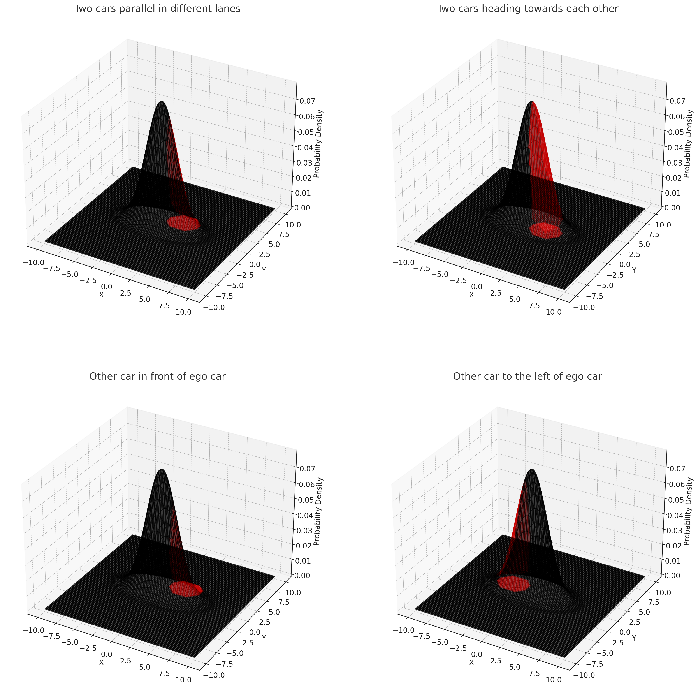

# Risk Assessment System Overview

This README provides an overview of the risk assessment system described in the associated LaTeX presentation. The system utilizes probabilistic metrics to offer a comprehensive understanding of potential road hazards.

## Table of Contents
1. [Overview](#overview)
2. [Collision Probability](#collision-probability)
3. [Crash Severity](#crash-severity)
4. [Overall Collision Risk](#overall-collision-risk)
5. [References](#references)

## Overview

The risk assessment system is inspired by the risk metric presented in the paper by Wang et al., which incorporates two key metrics: collision probability and severity. Unlike the approach in the original paper, this model preserves the time-series output to meet specific requirements.

## Collision Probability

Collision Probability gauges the likelihood of a future collision at time \( t + \Delta t \). It is mathematically expressed as:

$$
c_{i}(t + \Delta t) = \int\!\!\!\int_{A} f_{i}^{(t + \Delta t)}(x, y) \, dx \, dy
$$

Where \( A \) represents the integration domain, specifically, the collision octagon. This concept is inspired by the paper "Analytic Collision Risk Calculation for Autonomous Vehicle Navigation".

## Crash Severity

Crash Severity is quantified using the following formula:

$$
s_{i}(t + \Delta t) = \frac{1}{2}M\beta^{2}( V_{i}^{t + \Delta t})^{2}
$$

Where \( M \) refers to mass and \( \beta \) is a scaling factor. The velocity \( V_{i}^{t + \Delta t} \) is estimated by the ratio of the distance between future trajectory points to the time interval.

## Overall Collision Risk

The overall collision risk function is derived by combining the above metrics:

$$
\text{risk}_{col}(t + \Delta t) = \sum_{i=1}^{m} p_i(t + \Delta t) \cdot c_i(t + \Delta t) \cdot s_i(t + \Delta t)
$$

Fusion of multiple metrics is done using:

$$
\text{risk}_{overall} = \sum_{i} w_i \cdot \mathcal{N}(\text{risk}_i)
$$

## References

1. Wang et al., "Probabilistic Risk Assessment for Road Hazards"
2. Philipp and Goehring, "Analytic Collision Risk Calculation for Autonomous Vehicle Navigation"
